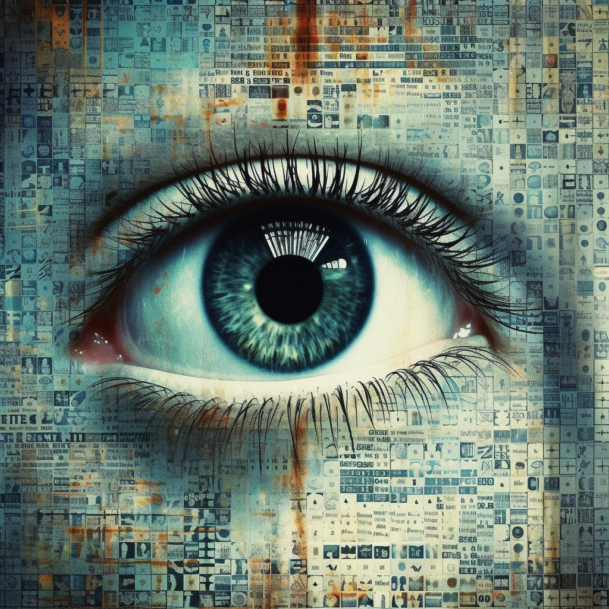
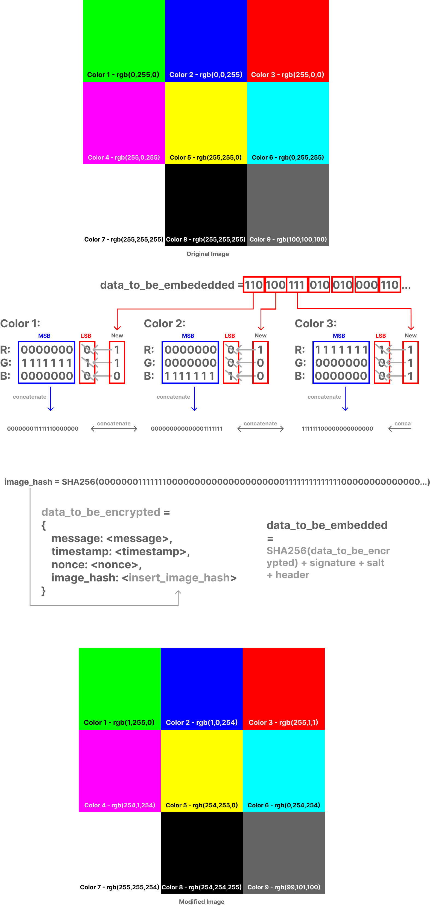

# Hidden in Plain Byte - Public Image Verification with Trusted Entities

  

The concept illustrated in this demo was specifically crafted for scenarios where maintaining the authenticity and integrity of data within an image is critically important. This includes any situation where images are shared publicly, allowing us to confirm their original source as well as track any changes made after their creation. For example, a social media platform could use it to ensure that an image has not been artificially created, providing a verification step that the uploader cannot circumvent.

### Public Visibility of the Embedded Data

All the information embedded in the image is publicly visible but is cryptographically secured. This ensures that any tampering with the data can be easily detected and verified by any viewer.

### Sender Signature

The sender signature is generated by the sender using their private key. It provides the guarantee that the message has indeed originated from the sender, and the message has not been tampered with in transit.

### Trusted Entity Signature

The trusted entity signature is a cryptographic stamp provided by a trusted third-party, such as a certifying authority, which confirms the origin of the image. It adds an extra layer of security to the image and the data embedded within.

### Image Hash Verification

Image hash verification is used to verify that the image has not been tampered with. This is done by comparing the hash of the image (with the embedded data) excluding the least significant bit of each pixel channel with the original hash stored in the trusted entity data.

### Biometric Verification of Real Human

The script includes a placeholder for biometric verification of a real human. This is a measure to ensure that the image and the data embedded within it are not products of a synthetic media or deceptive AI.

### Modification and Filters Documentation

Any modifications or filters applied to the image are documented in the trusted entity data. This is a prophylactic way to combat synthetic media and deceptive AI. It ensures that any changes to the image are transparently recorded and verifiable by any viewer.

  

## How it works

### Encryption Page

On this page, you (Alice, Bob, or Charlie) can select an image and enter a message that you want to hide within the image. Here's how it works:

1. Choose an image file or use the camera to capture an image.
2. Enter your secret message.
3. Press the `Sign and Embed Message` button. This triggers the encryption and embedding process:
   - The application calculates the SHA-256 hash of the image, excluding the least significant bit of each pixel channel.
   - A set of trusted entity data is created and signed using the trusted entity's key.
   - Your message, the trusted entity data, and the trusted entity's signature are combined and signed using your private key.
   - The combined data is then embedded into the image using the LSB steganography technique.
4. The modified image is then displayed and you can download it for further use.

  

### Decryption Page

On this page, you can upload the encrypted image to reveal the hidden message. Here's how the decryption process works:

1. Upload the encrypted image.
2. Press the `Decrypt Message from Image` button:
   - The application extracts the embedded data (message, original image hash, signatures) from the image.
   - It verifies the authenticity and integrity of the message by checking the sender's signature using their public key.
   - It checks the signature of the trusted entity to ensure the authenticity and integrity of the trusted entity data.
   - It verifies the integrity of the image by comparing the image's hash (excluding the least significant bit of each pixel channel) with the original image hash stored in the trusted entity data.
3. If all verifications pass, the original data, including the hidden message, is displayed on the page.

## Potential Weaknesses of this Demo

While this application uses robust cryptographic techniques, it is a conceptual demo and should only be used as such. With that said, here are some of the potential weaknesses of the demo:

* Image Transmission: The image must be transmitted without any form of lossy compression (such as JPEG compression), which could remove or alter the hidden data, so for the time being this demo is focused on `.png` images.
  
* Limited Message Size: The length of the hidden message is limited by the size of the image. Large messages may require larger images.

* Digital Signature Compromise: If the sender's private key is compromised, an attacker could forge digital signatures.

* Steganography Technique: LSB Steganography is one of the less advanced forms of Steganography, there are some forms that may be better suited for this type of application.

* RGB Channel: While the Image hash function creates a hash of the image bits, excluding the least significant bits, of all three color channels Red, Green, and Blue, the encrypted data was only embedded in the Red Channel for this demo; however, this is a minor fix that allows for larger embedded files that wasn't necessary for this demo.

## Additional notes

- For future improvement I would look into applying steganography alternatives to LSB.
- The hash verification currently is inefficient especially with larger image sizes.
- The trusted entity metadata is arbitrary for the sake of the demo, it could include more or less fields to survey the image history.

## Contact

- Author: **Preston Kirschner**
- Socials: [LinkedIn](https://www.linkedin.com/in/preston-kirschner/) | [Github](https://github.com/P-carth) | [Twitter](https://twitter.com/Prestonk_)
- Opensource project: [Huggingface](https://huggingface.co/spaces/P-carth/hidden_in_plain_byte-public_image_verification)

I would love to hear your feedback (positive or negative)! Please reach out on one of the socials above if you have questions or comments.
